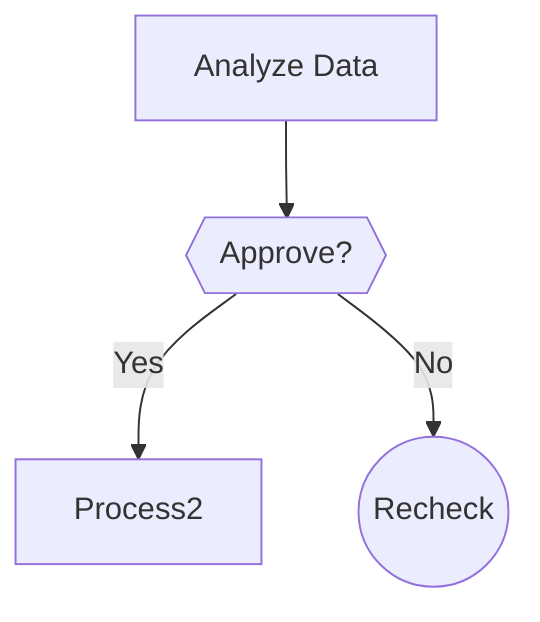
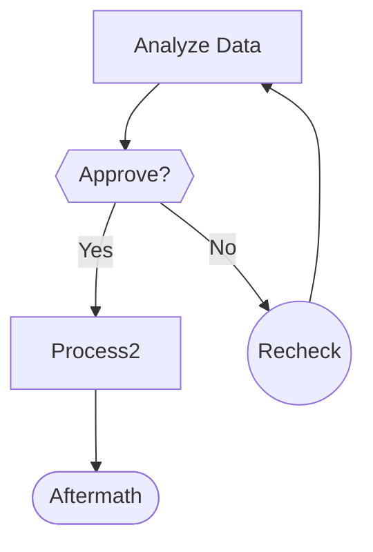

# README_STYLE.md

Style guide for creating README.md documentation files.

Make in exactly this order, with only these elements (omitting element is permissable, if element is not applicable):

```markdown
- Project title
- Mermaid chart or graph - Use only clean strings. Always start and end with ```mermaid code blocks```. Define node labels using square brackets (e.g., A[Label]), never use curly braces "{}", parentheses "()", or colons ":".
- Executive summary (use "- " for clean list design)
- Usage (use code blocks)
```

## Example README.md:

````markdown

# Example Title



## Executive Summary

- Important summary point
- Key take away
- More important information

## Usage

**CLI – simple prompt**
```bash
python -m example.cli "Summarize the latest AI research headlines"
```

**Python - script usage**
```python
import example
result = example.summarize("Latest AI research headlines")
print(result)
```

````

## MERMAID STYLE GUIDE

### **IMPORTANT**
**DO NOT USE** NESTED BRACKETS OF ANY KIND, FOR EXAMPLE:

- wrong: `Lookup[Lookup Rate (with Forward Fill)]`
- wrong: `Convert[Convert {Cur}rency]`

---

### **1. Rules**

- Define all nodes **before** connections

- Use **descriptive IDs** and labels:

  - Processes: `A[Process Step]`
  - Decisions: `B{{Decision Point}}`
  - Connections: `D((Connection))`

- Use directional arrows `-->` with optional labels:
  `C -->|Yes| D`

- Connect nodes **after** all definitions

#### Shapes

| Type       | Syntax  | Example               |
| ---------- | ------- | --------------------- |
| Process    | `[]`    | `Process1[Step 1]`    |
| Decision   | `{{}}`  | `Decision{{Choice?}}` |
| Connection | `(( ))` | `Link((Node))`        |

- Do not apply styling, leave vanilla

- **Limit nodes**: Keep under 20 nodes for clarity

- **Naming**: Use meaningful labels

- **Readability**: 1 element per line

#### **Example**:



---

### **IMPORTANT**
**DO NOT USE** NESTED BRACKETS OF ANY KIND, FOR EXAMPLE:

- wrong: `Lookup[Lookup Rate (with Forward Fill)]`
- wrong: `Convert[Convert {Cur}rency]`

